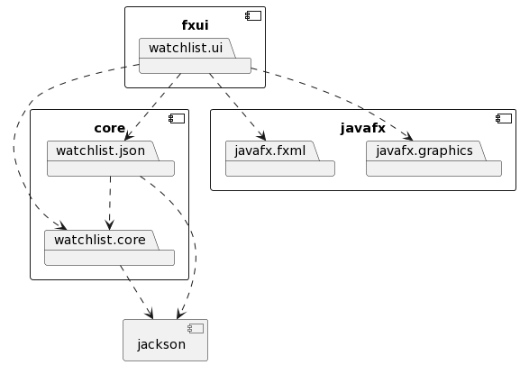

[ Release 2](release2.md)

Denne siden beskriver arkitekturen til prosjekter per innlevering 2.

# Arkitektur 

Arkitekturen til watchlist består av 2 deler: representasjonslaget, som håndterer domenelogikken og fillagring, og brukergrensesnittet, som sluttbrukeren forholder seg til. Disse delene samsvarer med modulene som koden er oppdelt i.

## Moduler

Representasjonslaget til watchlist ligger i core-modulen. Denne er videre oppdelt i core/.../core og core/.../json, hvor json mappen inneholder SaveLoadHandler klassen, som håndterer fillagring. Selve json filene er lagret i core/src/main/resources/json. 

Brukergrensesnittet ligger i mappen fxui. Denne modulen er avhengig av core.

## Diagram

Pakkediagrammet under viser avhengigheter mellom modulene i watchlist og til eksterne biblioteker. p1-->p2 indikerer at p1 er avhengig av p2. 

