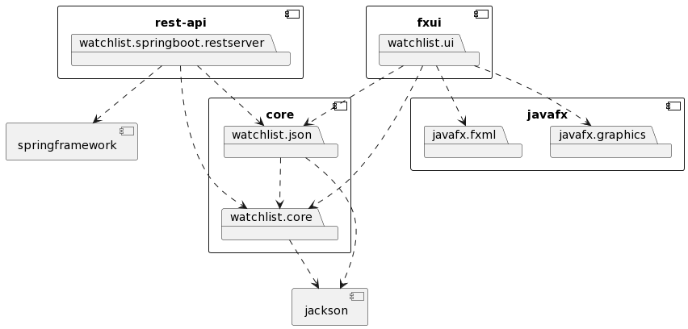
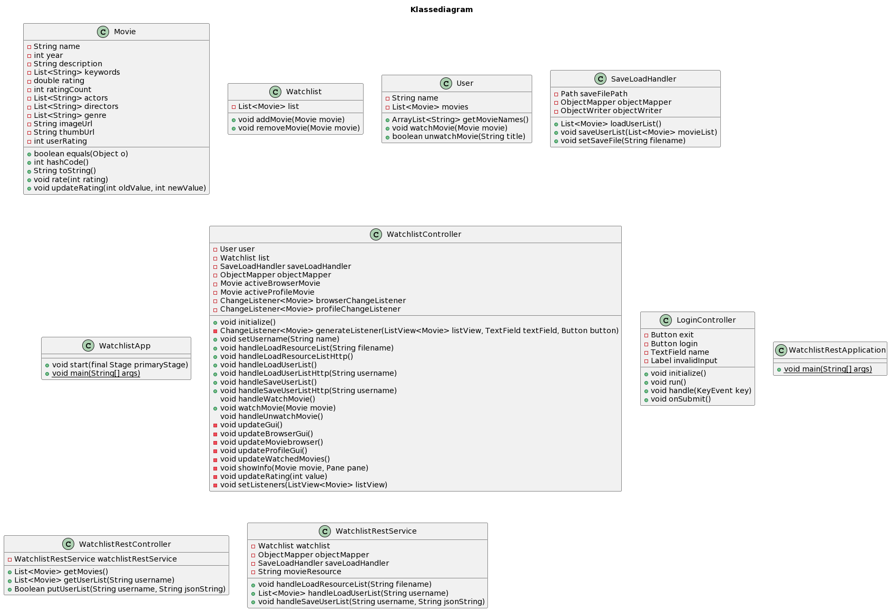

[Release 3](release3.md)

Denne siden beskriver arkitekturen til prosjektet per innlevering 3, og hvilke endringer som har blitt gjort siden sist gang.

# Arkitektur

Fra forrige iterasjon har arkitekturen til Watchlist blitt utvidet, da vi har lagt til et REST-api med en tilhørende REST-server.

## Moduler

Den nye REST-funksjonaliteten ligger i __watchlist.springboot.restserver__ modulen. Denne baserer seg på spring rammeverket. For å tilpasse applikasjonen har vi også måtte gjøre noen endringen i de eksisterende modulene, slik at disse kan kommunisere med REST-serveren.

*core*: __watchlist.core__, __watchlist.json__

Var nesten ingen endringer her (la til en setName() metode), da kjernemodulen ikke kommuniserer direkte med REST-serveren i vår modell.

*fxui*: __watchlist.ui__

I ui-modulen har vi endret på hvordan innlastingen av filmer skjer. Tidligere ble denne hentet gjennom et kall til metoden handleLoadResourceList() i initalize(), som lastet inn filmressursen (movies.json) direkte. Her har vi lagt til en ny metode, handleLoadResourceListHttp(), som oppretter en forbindelse med REST-serveren og etterspør listen med filmer derfra.

**

## Diagram

Pakkediagrammet under viser avhengigheter mellom modulene i watchlist og til eksterne biblioteker. p1-->p2 indikerer at p1 er avhengig av p2.

*Pakkediagram*

Klassediagrammet viser de viktigste delene av de forskjellige klassene i prosjektet. Merk at WatchlistController også importerer en del variabler fra Watchlist.fxml, men disse vises ikke her da det ville blitt for uoversiktlig.

*Klassediagram*
