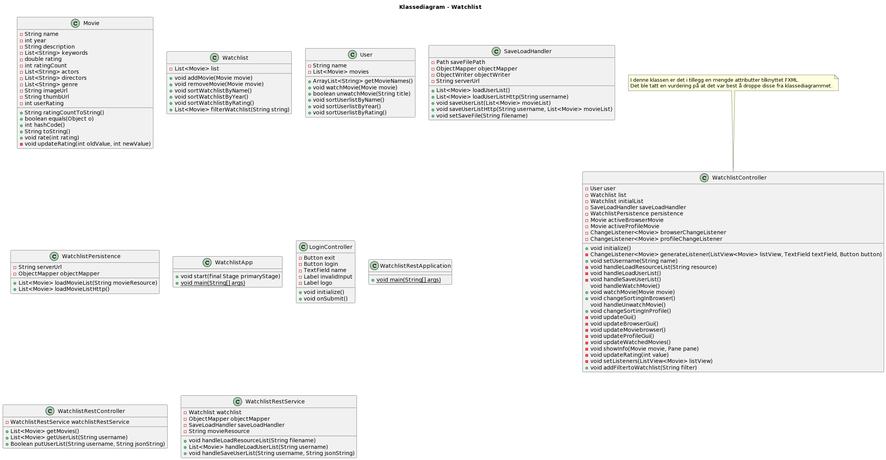

[Release 3](release3.md)

Denne siden beskriver arkitekturen til prosjektet per innlevering 3, og hvilke endringer som har blitt gjort siden sist gang.

# Arkitektur

Fra forrige iterasjon har arkitekturen til Watchlist blitt utvidet, da vi har lagt til et REST-api med en tilhørende REST-server.

## Moduler

Den nye REST-funksjonaliteten ligger i __watchlist.springboot.restserver__ modulen. Denne baserer seg på spring rammeverket. For å tilpasse applikasjonen har vi også måtte gjøre noen endringen i de eksisterende modulene, slik at disse kan kommunisere med REST-serveren.

*core*: __watchlist.core__, __watchlist.json__

Vi hadde egentlig ikke planer om å gjøre store endringer i core-modulen, men mot slutten av prosjektet kom vi fram til at det ga mening å flytte mer av logikken for fillagring til core, framfor at fxui lastet inn filmdatabasen direkte. Dermed måtte vi lage en ny klasse i watchlist.json, __WatchlistPersistence__, som håndterer innlasting av filmdataen. Å dele opp koden slik virket logisk for oss, da vi fikk fjernet avhengigheten fxui hadde til jackson modulen, samtidig som vi abstraherer bort selve innlastingen. Dette gjorde koden i WatchlistController mye mer oversiktlig.

*fxui*: __watchlist.ui__

I ui-modulen har vi endret på hvordan innlastingen av filmer skjer. Det er fortsatt samme metoden handleLoadResourceList() som håndterer innlastingen, men logikken har som nevnt blitt flyttet til json modulen i core. Det denne metoden gjør nå er først å kalle på metoden loadMovieListHttp() i WatchlistPersistence. Dersom dette mislykkes forsøker den å laste en lokal filmressurs med WatchlistPersistence.loadMovieList(String resource) i stedet. Denne endringen førte til kode som var langt mer oversiktlig og lesbar, og flyttet også implementeringsdetaljer som ikke var viktig for hvordan controlleren i seg selv fungerte, til json modulen.

*rest-api*: __watchlist.springboot.restserver__

Vi valgte å bruke spring-boot rammeverket til å implementere REST-serveren, da vi syntes dette virket som et rammeverk som var enkelt og forstå og med gode læringsressurser tilgjengelig. Modulen består av tre klasser, og har støtte for 3 forskjellige Http requests. Vi har to GET-metoder, én for å laste inn filmdatabasen (kalles i WatchlistPersistence.loadMovieListHttp()), og én for å laste inn en brukers sette filmer (kalles i SaveLoadHandler.loadUserListHttp()). Det er også en PUT metode, som lagrer brukerens sette filmer (kalles fra SaveLoadHandler.saveUserListHttp()).

De forskjellige typene REST-forespørsler som kan sendes er:

GET /movies
GET user/{username}
PUT user/{username}

## Diagram

Pakkediagrammet under viser avhengigheter mellom modulene i watchlist og til eksterne biblioteker. p1-->p2 indikerer at p1 er avhengig av p2.

*Pakkediagram*

Klassediagrammet viser de viktigste delene av de forskjellige klassene i prosjektet. Merk at WatchlistController også importerer en del variabler fra Watchlist.fxml, men disse vises ikke her da det ville blitt for uoversiktlig.

*Klassediagram*
