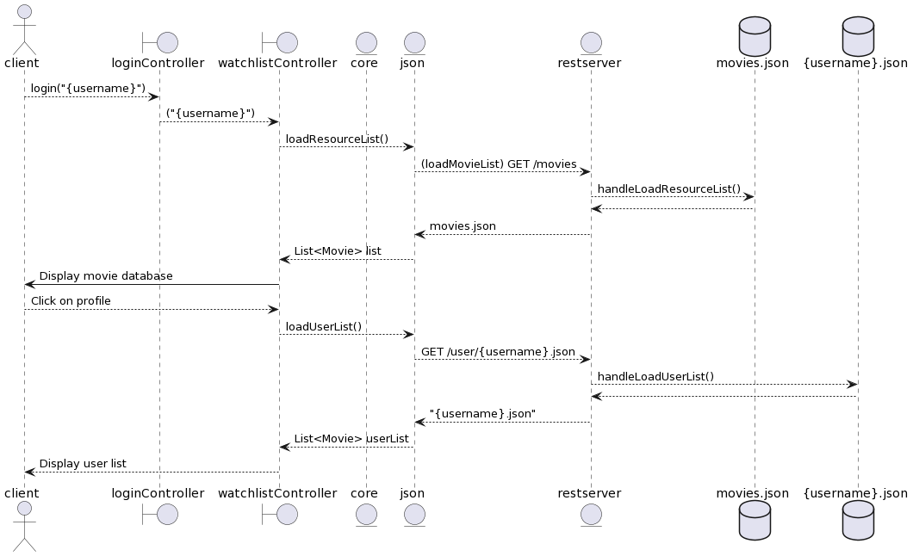

[ Tilbake ](../../README.md)

# Dokumentasjon Release 3

## [Arkitektur](arkitektur.md)

## Deployment

Vi har implementert **JLink** for å pakke applikasjonen sammen. JLink genererer filer og mapper som gjør det enklere å installere applikasjonen på andre enheter enn utviklerens enhet. Disse filene og mappene er noe uoversiktlig og tungvint for brukeren å måtte installere alle andre pakker og plugins. Dette løser vi med **JPackage**.

    mvn javafx:jlink -f ./watchlist/fxui/

JPackage komprimerer filene fra JLink til en enkelt installeringsfil basert på operativsystemet kommandoen blir kjørt. Filen er av typen `.dmg` for MacOS, `.exe` for Windows, og `.deb` for Linux.

    mvn jpackage:jpackage -f ./watchlist/fxui/

Det skal nevnes at vi ikke fikk bildene til å laste inn i applikasjonen. Da forelesningen kom relativt tett på innleveringsfristen, rakk vi ikke å fikse opp i dette problemet. Vi brukte noe tid til å diskutere hvordan dette potensielt kunne blitt fikset.

Én tanke er at vi kunne lagret bildene lokalt i appen, men vi anså dette som mindre gunstig med tanke på programmets størrelse. En annen idé var å bruke caching til å hente inn bilder i bolker for å sikre at de filmene som vises for brukeren er lastet inn, for så å laste inn bildene fortløpende i bakgrunnen. Da denne delen av innleveringen virket mindre viktig valgte vi heller å bruke tiden på andre mer sentrale utviklingsoppgaver.

## Arbeidsvaner

Under arbeidet med innlevering 3 har vi lagt enda større vekt på god arbeidsmetodikk og tatt med oss tilbakemeldinger på innlevering 2. Blant annet fikk vi innspill om at vi burde inkludere issue-nummer først i commit-meldingen. Dette har vi gjennomført der det er naturlig å knytte til en spesifikk issue. Vi har også valgt å fortsette med å legge til issue-nummer på enden av commit-meldingen for å helgardere oss, samt sørge for at det ikke er noen tvil hvilken issue commiten tilhører.

Alle medlemmene i gruppa har fått tid til å venne seg til det standardiserte commit-oppsettet vårt. Noen commits blir noe store da man kan jobbe på flere deler av programmet samtidig, som til slutt ender opp med å kunne blitt delt i mindre commits for en mer oversiktlig commit-historikk.

Med flittig bruk av VSCodes LiveShare-funksjon har vi også fått samhandlet på flere issues i sanntid uten å måtte vente på andres commits, eller å henge over hverandres PC. Dette vises også med en økning i antall commits merket `co-authored-by`.

### Git

Vi har fortsatt å bruke git på samme måte som under innlevering 2, da vi erfarte at dette fungerte bra. Gruppemedlemmene har under arbeidet med prosjektet blitt bedre på å bruke git på en hensiktsmessig måte, noe som er tydelig når vi ser på forbedringen i commit-meldinger fra starten av prosjektet og mot slutten.

### Testing og kodekvalitet

Detaljer om plug-ins brukt for kodekvalitet finnes i [dokumentasjone for release 2](../release2/release2.md), da vi ikke har gjort noen merkbare endringer siden sist.

For denne innleveringen har vi forsøkt å fortsatt holde høy testdekningsgrad samtidig som vi har utvidet funksjonaliteten og endret på arkitekturen. En spesiell utfordring var å teste REST-api-et, hvor vi i utgangspunktet ikke visste hvordan vi skulle teste HTTP klienten. Der endte vi opp med å bruke Wiremock biblioteket for å teste at klienten sendte Http requests som samsvarte med spesifikasjonene i REST-api-et vårt.

## Sekvensdiagram

