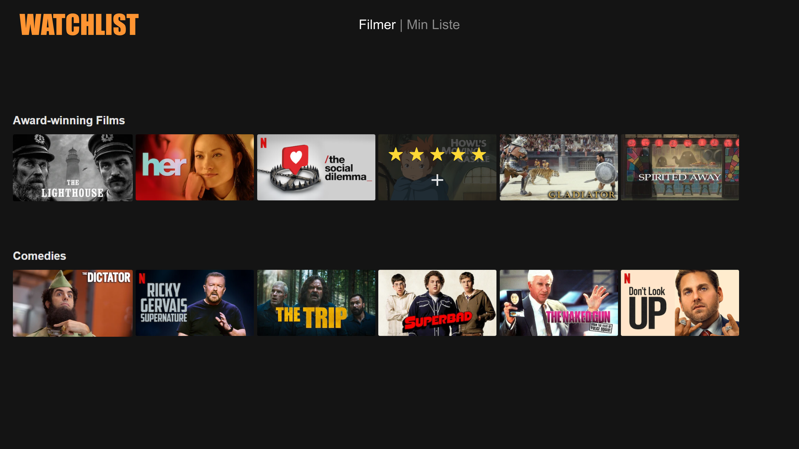

# Watchlist

Watchlist er en app som gjør det mulig for en bruker å holde orden/kontroll på filmer i en redigerbar liste hvor man for eksempel kan vurdere filmer, og legge til filmer i sin egen "watchlist". Brukeren vil også kunne se en oversikt over filmer man har sett og ikke sett ved hjelp av lagring i sky.

### Brukerhistorie #1 - Se oversikt over filmer

Som bruker av Watchlist vil jeg se en oversikt over tilgjengelige filmer.
